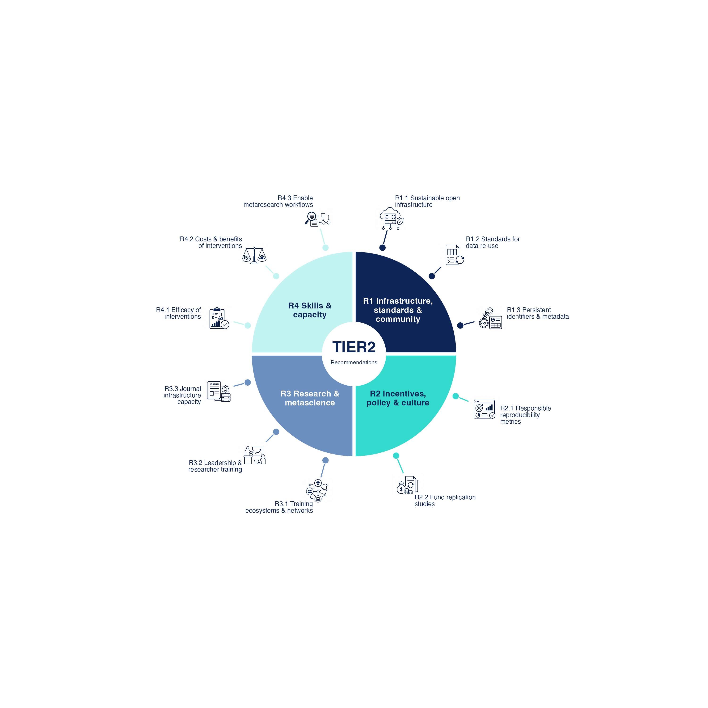

# TIER2 recommendations

Visualisations of the TIER2 recommendations for strengthening research
reproducibility. The repository contains publication-ready static figures and a
self-contained interactive webpage showing how the recommendations relate to
stakeholder groups, thematic categories, implementation effort, and expected
impact.



## Outputs

### Publication figures

[`01_publication_static/circle_diagram.R`](01_publication_static/circle_diagram.R)
generates two figure layouts in PDF and 300 dpi PNG formats:

- a circular overview with stakeholder-specific panels;
- a spoke diagram with one icon and label per recommendation.

Generated files are stored in [`01_publication_static/output/`](01_publication_static/output/).

### Interactive visualisations

[`02_interactive_plots/TIER2_stakeholder_matrix.qmd`](02_interactive_plots/TIER2_stakeholder_matrix.qmd)
renders a self-contained HTML page containing:

- a filterable stakeholder responsibility matrix;
- a stakeholder–recommendation network;
- a priority × effort matrix.

The rendered page is available locally at
[`02_interactive_plots/TIER2_stakeholder_matrix.html`](02_interactive_plots/TIER2_stakeholder_matrix.html)
and is configured for publication at
[inquisitive-quokka-25f881.netlify.app](https://inquisitive-quokka-25f881.netlify.app).

## Repository structure

```text
.
├── 01_publication_static/
│   ├── circle_diagram.R             # Static figure generation
│   ├── TIER2_recommendations.xlsx   # Recommendation data
│   ├── icons/                       # Recommendation icons
│   └── output/                      # Generated PDF and PNG figures
├── 02_interactive_plots/
│   ├── TIER2_stakeholder_matrix.qmd # Interactive Quarto source
│   ├── TIER2_recommendations.xlsx   # Recommendation data
│   ├── TIER2_priority_effort_ratings.csv
│   └── TIER2_stakeholder_matrix.html
├── 03_archive_sandbox/              # Superseded experiments and outputs
└── TIER2_recommendations.Rproj       # RStudio project
```

The two active output folders currently keep separate copies of the
recommendation workbook. When recommendation content changes, update both
copies or explicitly verify that they are still aligned. Files under
`03_archive_sandbox/` are retained for reference and are not part of the
current build workflow.

## Requirements

- R
- Quarto, for the interactive page
- The following R packages:
  - `tidyverse`
  - `ggforce`
  - `patchwork`
  - `stringr`
  - `readxl`
  - `geomtextpath`
  - `ggimage`
  - `visNetwork`
  - `htmlwidgets`
  - `htmltools`
  - `jsonlite`

Install the R dependencies with:

```r
install.packages(c(
  "tidyverse", "ggforce", "patchwork", "stringr", "readxl",
  "geomtextpath", "ggimage", "visNetwork", "htmlwidgets",
  "htmltools", "jsonlite"
))
```

## Reproducing the outputs

Clone the repository and run commands from its root directory. The scripts also
locate their input folders when launched from elsewhere within the repository.

Generate the static figures:

```sh
Rscript 01_publication_static/circle_diagram.R
```

Render the interactive page:

```sh
quarto render 02_interactive_plots/TIER2_stakeholder_matrix.qmd
```

The Quarto output is self-contained, so the resulting HTML file can be published as a single file.

## Data notes

The static and interactive outputs intentionally use different recommendation
sets at present:

- the interactive page reads all 12 recommendations in its workbook; TO BE CHANGED!!! (also to add here would be an interactive Kohrs et al style visual)
- the static script removes the original `R2.1`, renumbers `R2.2` and `R2.3`,
  and displays 11 recommendations with shortened figure labels.

Priority and implementation-complexity ratings (draft/conceptual ratinngs ONLY) use a 1–5 scale and are stored
in [`02_interactive_plots/TIER2_priority_effort_ratings.csv`](02_interactive_plots/TIER2_priority_effort_ratings.csv).

